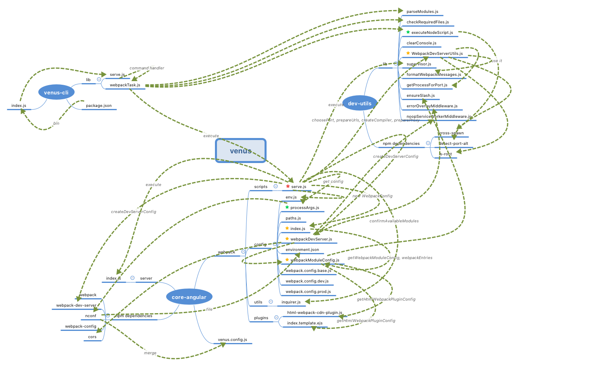

# venus serve command summary
## structure diagram

## Key modules:

### config related
1. `core-angular/webpack/scripts/serve.js`
-- the **gather point** of `venus serve` command related configurations.

 

2. `dev-utils/lib/WebpackDevServerUtils.js`
-- `createCompiler` create a `compiler` instance.
-- other `webpack dev server` related `utils`, eg. `choosePort`, `prepareUrls`, `prepareProxy`.

 

3. `core-angular/webpack/config/webpackModuleConfig.js`
-- generate `webpack` config object according to different enviorment.

 

4. `core-angular/webpack/config/index.js`
-- defined `WebpackConfigBase` constructor, whose `prototype` has `getNodeEnv`, `getWebpackConfig` and `getAvailableEntries` methods. `getWebpackConfig` requires `webpackModuleConfig.js` to get `webpack` config object.
 

### Utils related
1. `core-angular/webpack/config/processArgs.js`
-- generate venus config file according to `argv`, `env`, `environment.json` and `venus.config.js`.
 

2. `dev-utils/lib/executeNodeScript.js`
-- execute command in `child process` using `cross-spawn` module.

